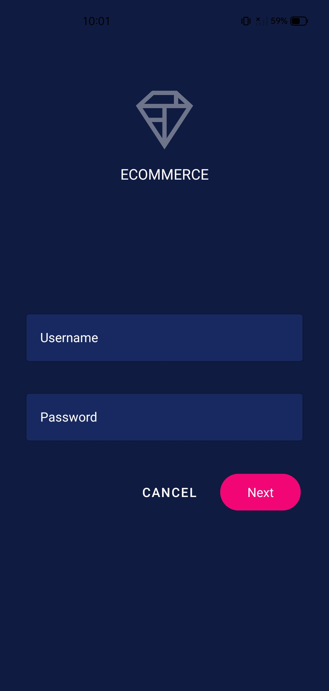
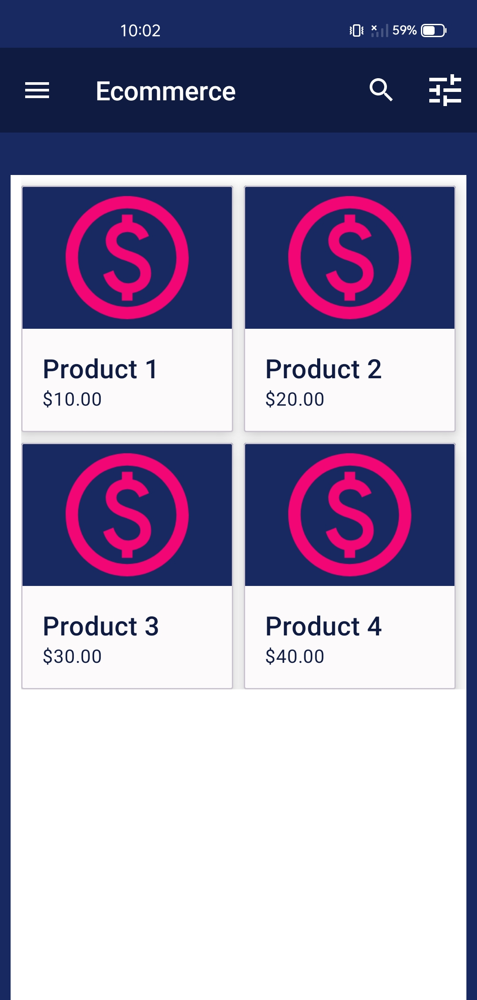
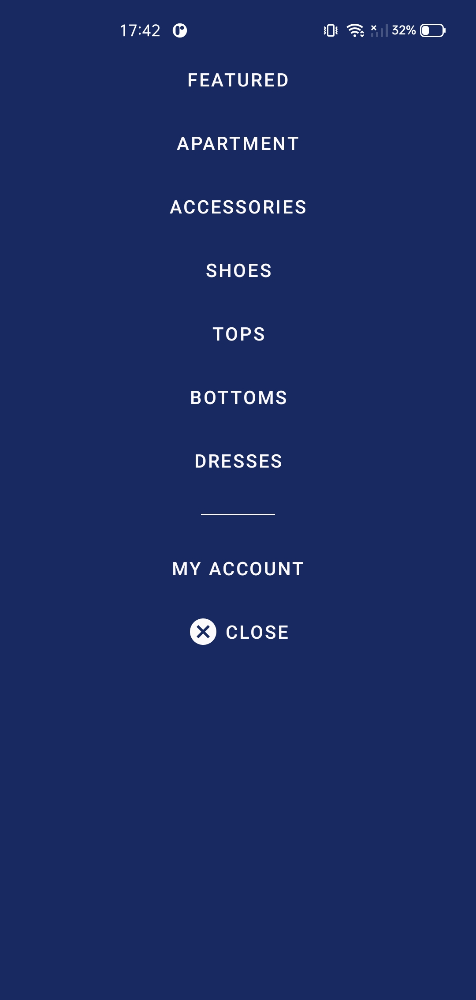

# 🛍️ Ecommerce App – Android & Kotlin

---

Modern **Ecommerce App** built to showcase advanced **Material Design 3**, **Kotlin** and **MVVM** skills for Android.

---

## ✨ About this project
A clean, modern and scalable ecommerce app built to demonstrate:
- **Native Android development** expertise
- Application of **Material Design 3** best practices
- **Clean Architecture** with MVVM, Data Binding & LiveData
- Focus on **UX-centric** design and performance optimization

🚀 **Status:** On Going

---

## 📱 Screenshots

  
  
  
   
   
  

---

## 💻 Tech Stack & Architecture
- **Kotlin 1.9.0** – modern, safe and concise
- **MVVM Architecture** – clean separation of concerns
- **Data Binding & LiveData** – reactive UI updates
- **Material Design 3** – Google’s latest design system
- **RecyclerView & CardView** – efficient UI rendering
- **Gradle (Kotlin DSL / kts)** + Libs version control (**TOML**)
- **XML layouts** & UX best practices

---

## 🛠 Tools & Environment
- **Android Studio Koala**
- **Git & GitHub** – version control and CI/CD
- Agile methodology: **Kanban**

---

## 🎨 UI & UX Highlights
- Modern, responsive design aligned with Material guidelines
- Consistent visual language and smooth interactions
- Optimized for real-world ecommerce scenarios
- Light & dark theme ready

---

## 🌍 Why this project matters
European tech companies value:
- **Clean, scalable Kotlin code**
- Real implementation of **Google Material Design**
- Production-ready **MVVM architecture**
- Strong focus on **user-centric experience**

This project is built to reflect those demands and demonstrate **readiness for professional Android development in the European market**.

---

## 🧪 Testing (planned)
- Unit tests (JUnit)
- UI tests (Espresso)
- Integration tests

---

## 📦 Future improvements
- Dependency Injection (**Hilt**) 

---

## ✅ Status
Project is **On Going** – actively improved and documented.

---

## 💡 Want to build something together?
📩 Message me or 👉 [**Connect on LinkedIn**](https://www.linkedin.com/in/laura-oliveira-mobile/)  
Let’s create modern, robust and beautiful Android apps that stand out in the market.

---

> ⭐ *Thank you for visiting! Let’s build something impactful together.*
